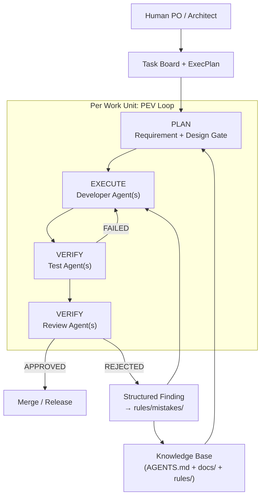

# AI-native Software Engineering Harness 架构设计总结

> 基于 OpenAI Harness Engineering、SWE-agent 论文、arXiv「Code as Agent Harness」、Metaswarm/devt/Ouroboros 等开源实践，以及 Augment Code、Martin Fowler 等资料的调研总结。
>
> 对应初始构想见 [idea.md](./idea.md)

---

## 一、核心结论：你要建的不是「多 Agent」，而是「控制平面」

业界已形成共识：

> **Agent = Model + Harness**

模型负责推理；Harness 负责约束、编排、验证、记忆与安全。Martin Fowler 将其比作「赛博netic governor」——通过前馈（规则/上下文）和反馈（测试/Review）把概率性输出收敛到可交付状态。

目标——开发 Agent 写代码、测试 Agent 验功能、Review Agent 发现问题并反哺知识库——正是当前最被验证的模式，称为 **Creator-Verifier Pattern**（创建者-验证者分离）。独立验证比自验证正确率提升约 **12%–26%**；Factory.ai 的对抗性验证器在 Slack clone 项目中发现了 81 个问题，其中 34% 的修复工作来自 Review 反馈。

**关键转变**：人类角色从「写代码」变为「设计环境、定义意图、构建反馈回路」。OpenAI Harness 团队用 3–7 名工程师 + Codex，5 个月交付约 100 万行代码、1500 个 PR，核心不是模型更强，而是 Harness 更完整。

---

## 二、推荐架构：Bounded Workflow + PEV 闭环

业界生产环境普遍**拒绝**无约束的多 Agent 蜂群，转向 **有界、确定性的状态机工作流**。推荐采用 **Supervisor + Phase-Gating + Plan-Execute-Verify (PEV)**：



### 与 idea.md 的对应关系

| 你的设计 | 业界最佳实践补充 |
|---------|----------------|
| Developer / Test / Review Agent | 加上 **Orchestrator/Supervisor** 做任务分解、状态机、迭代上限 |
| Memory System | 升级为 **三层 Codified Context**（见第四节） |
| Feedback Loop | 必须 **结构化 Finding** + **机械门禁**，不能只存聊天记录 |
| 分阶段实施 | 与 Metaswarm 的 IMPLEMENT→VALIDATE→ADVERSARIAL REVIEW→COMMIT 一致 |

### 每个 Work Unit 的标准生命周期

参考 Metaswarm、devt、Ouroboros 的生产实践：

```
1. DECOMPOSE  → 拆成原子任务（文件范围、DoD、依赖图）
2. PLAN       → 生成/更新 ExecPlan（自包含、可验证）
3. IMPLEMENT  → Developer Agent（git worktree 隔离）
4. VALIDATE   → Test Agent **独立运行**测试（不信 Agent 自报）
5. REVIEW     → Review Agent（对抗性、带 file:line 证据）
6. LEARN      → 结构化写入 knowledge base
7. COMMIT     → 仅当所有 Gate 通过
```

**迭代上限**：Review/Test 失败最多 3–5 轮，之后升级给人类，避免无限循环。

---

## 三、Harness 九大组件（评估清单）

arXiv 2605.18747 和 Claude Code Guide 总结了成熟 Harness 的 9 个组件，可作为框架设计 checklist：

| 组件 | 作用 | 场景建议 |
|------|------|----------|
| **While-Loop Engine** | Agent 主循环 | 必须有步数/成本/超时上限 |
| **Context Management** | 上下文装配 | 渐进式披露，禁止 monolithic prompt |
| **Tool Registry** | 工具目录 | 为 Agent 设计专用 ACI，不用裸 shell |
| **Sub-Agent Management** | 子 Agent 委派 | 最小权限，不继承父 Agent 权限 |
| **Built-in Skills** | 确定性操作 | lint、test、db query 应是 skill 而非 LLM 推理 |
| **Session Persistence** | 会话持久化 | 状态外置到文件/DB，不靠 context window |
| **Dynamic Prompt Assembly** | 动态 prompt | 按任务类型加载 rules + memory |
| **Lifecycle Hooks** | 生命周期钩子 | pre/post tool、on-error 插桩 |
| **Permission Enforcement** | 权限强制 | 沙箱 + 身份网关，不靠人工点批准 |

Harness 还需三个基础属性：**可执行**（能验证 Agent 实际做了什么）、**可检查**（失败时有诊断输出）、**有状态**（跨 session 可恢复）。

---

## 四、知识系统：从 Memory 升级为 Codified Context

`memory/mistakes/` 思路正确，但需按 OpenAI / arXiv 2602.20478 升级为 **分层、机器可读** 的知识架构：

```
AGENTS.md          ← 约 100 行「目录」，不是百科全书
docs/
├── design-docs/   ← 架构、ADR、核心信念
├── exec-plans/
│   ├── active/    ← 进行中的 ExecPlan（自包含、可验证）
│   └── completed/
├── product-specs/ ← 功能规格 + 验收标准
├── QUALITY.md     ← 各模块质量评分
├── SECURITY.md    ← 安全规则
└── generated/     ← 自动生成的 schema/API 文档

knowledge/         ← mistakes/rules（结构化 JSON/JSONL）
├── security_rules.json
├── backend_mistakes.json
└── patterns/
```

### 关键原则

1. **渐进式披露**：Agent 从 AGENTS.md 导航，按需加载，避免 context 被挤爆
2. **机械验证**：CI 检查 docs 新鲜度、交叉链接、规则覆盖率
3. **Repo 即唯一真相**：Slack/脑中的决策若不在 repo，对 Agent 等于不存在
4. **Review Finding 必须结构化**：

```json
{
  "rule_id": "SEC-001",
  "severity": "HIGH",
  "category": "Security",
  "file": "user.service.ts",
  "line": 42,
  "problem": "Raw password stored",
  "recommendation": "bcrypt.hash before persist",
  "times_detected": 1,
  "enforcement": "ci-linter-rule-SEC001"
}
```

光存 mistake 不够——最终要变成 **CI linter / 结构测试**，让同类错误无法再合并。

---

## 五、Agent 分工设计（精炼版）

不要万能 Agent。参考 OpenAI、Metaswarm、devt 的分工：

### 编排层（必须有）

- **Orchestrator/Supervisor**：任务分解、状态机、Gate 控制、不信子 Agent 自报
- **Requirement Agent**：Issue → 结构化任务 + 验收标准

### 执行层（按领域拆分）

- **Frontend Agent**（Angular）
- **Backend Agent**（Koa）
- **DB Agent**（Sequelize migrations/schema）

### 验证层（Creator-Verifier，必须独立上下文）

- **Unit/Integration Test Agent**：跑测试、读覆盖率
- **Browser Test Agent**：Playwright + CDP（DOM snapshot、截图）
- **API Test Agent**：调用后端 API、校验响应
- **DB Verification Agent**：查数据库状态

### 审查层（对抗性，可用不同模型）

- **Code Review Agent**：规范、可维护性
- **Security Review Agent**：OWASP、注入、鉴权
- **Architecture Review Agent**：层级依赖、接口一致性

### 学习层

- **Knowledge Curator**：从 Review/Test 失败中提取规则，去重、升级 enforcement
- **Doc Gardening Agent**：扫描文档与代码漂移，自动开 fix PR

**权限模型**：Research/Review Agent 只读；Developer Agent 只能写自己 worktree；Orchestrator 不能改代码。

---

## 六、技术栈选型建议

| 层级 | 推荐 | 理由 |
|------|------|------|
| **编排** | LangGraph | 状态机、checkpoint、human-in-the-loop、长任务恢复 |
| **代码执行** | OpenHands / SWE-ReX | 沙箱 shell、文件编辑、并行 worktree |
| **工具协议** | MCP | Agent-to-Tool 标准接口 |
| **E2E 测试** | Playwright Test Agents 三件套 | planner → generator → healer |
| **可观测性** | OpenTelemetry + Langfuse/Arize | 追踪每个 Agent 的 token、工具调用、失败点 |
| **参考实现** | Metaswarm / devt / Ouroboros | 完整 SDLC 编排 + 学习闭环 |

**组合模式**（LangGraph 官方也在推）：**LangGraph 管逻辑 + OpenHands 管沙箱执行**。

---

## 七、前人踩过的坑（必读）

### 1. Context 相关

| 坑 | 表现 | 对策 |
|----|------|------|
| **Context 耗尽** | 大仓库还没改完就 OOM | 任务级文件范围 + 检索式上下文，不 dump 全仓库 |
| **Monolithic AGENTS.md** | 规则腐烂、Agent 局部 pattern-match | 100 行目录 + docs/ 分层 |
| **Context Engine 缺失** | 更大窗口也没用，检索到错误/过时信息 | 9 层上下文：代码/产品/架构/约定/决策/权限/归属/验证/漂移 |

### 2. 多 Agent 协作

| 坑 | 表现 | 对策 |
|----|------|------|
| **Agentic Drift** | 不同文件各自正确，合在一起语义冲突 | git worktree 隔离 + 顺序合并 + AST 级锁定 |
| **架构漂移** | FP vs OOP 混用、命名风格分裂 | Architecture Review Agent + 机械 linter |
| **Merge 噩梦** | routes/config/registry 热点冲突 | 任务图分解，避免并行改同一热点 |
| **过度编排** | 18 个 Agent 互相等、成本爆炸 | 从 3 Agent 起步，按 Gate 失败率加 Agent |

### 3. 测试与验证

| 坑 | 表现 | 对策 |
|----|------|------|
| **信 Agent 自报「测试通过」** | 实际没跑或跑错 | Orchestrator **独立跑** `npm test` / Playwright |
| **测试分布失衡** | 70% 测工具、<5% 测 LLM 推理 | 20–30% 预算给 Agent 行为测试（pass^k 模式） |
| **纯 LLM-as-Judge** | 风格好但逻辑错，误判率 >50% | 机械检查为主，LLM Judge 为辅 |
| **测试修一个坏三个** | 无限循环 | 改前算 blast radius，限制迭代轮次 |

### 4. 工具与执行

| 坑 | 表现 | 对策 |
|----|------|------|
| **裸 shell 给 Agent** | `grep -rn` 输出爆炸 | SWE-agent ACI：bounded output 专用工具 |
| **Tool 幻觉** | 调用不存在的 API | 符号图验证 + lint-on-edit guardrail |
| **无停止条件** | 烧 token 到破产 | 步数/成本/连续失败/超时 + autosubmit |

### 5. 安全与治理

| 坑 | 表现 | 对策 |
|----|------|------|
| **Lethal Trifecta** | 私有数据 + 不可信内容 + 外联 = 数据泄露 | 网络隔离 + 沙箱 + 输出扫描 |
| **人工审批形同虚设** | 93% 权限请求被无脑批准 | 结构性隔离，不靠人点对话框 |
| **安全仅停留在 prompt** | 测试全过仍有 CVE | CI 层确定性拦截（SAST、secrets scan） |

### 6. 学习与记忆

| 坑 | 表现 | 对策 |
|----|------|------|
| **记忆=聊天记录** | 无法检索、无法执行 | 结构化 JSON + rule_id + enforcement 升级 |
| **规则只写不执行** | 同样错误反复出现 | mistake → linter rule → CI block |
| **知识在 repo 外** | Agent 看不到 Slack 里的架构决策 | 一切决策 check-in 到 docs/ |

---

## 八、针对 HCS 项目的落地路线图

结合 idea.md 的 Phase 1–4，对齐业界实践后建议：

### Phase 0：基础设施（1–2 周）

- 初始化 `AGENTS.md` + `docs/` 骨架
- CI 门禁：lint、test、覆盖率阈值、结构测试
- 每个任务一个 **git worktree**
- Orchestrator 状态机（哪怕先是脚本）

### Phase 1：最小闭环

```
Issue → Developer Agent → Test Agent（独立验证）→ Review Agent → Merge
```

- Review Finding → `knowledge/*.json`
- 上限 3 轮迭代

### Phase 2：测试纵深

- Playwright Browser Agent（登录、CRUD、WebSocket）
- API 脚本 Agent（Koa endpoints）
- DB 验证 Agent（Sequelize 查询断言）
- 接入 CDP：DOM snapshot + 截图给 Agent

### Phase 3：记忆 → 执行

- mistake 自动升级为 linter rule
- Doc Gardening Agent 防漂移
- Topic Pre-Flight Brief（devt 模式）：任务前自动注入相关 rules + 历史错误

### Phase 4：架构与规模化

- Architect Agent 生成 ADR + ExecPlan
- 并行 Developer Agent（worktree 隔离，顺序 merge）
- 可观测性：每个 Agent run 的 trace + cost

---

## 九、与 idea.md 的对照评价

### 已经做对的

- 生命周期视角（不是单 Agent）
- Review → Knowledge → 防再犯闭环
- 分阶段实施
- 结构化 mistake/rules
- 多类型 Test Agent

### 需要加强的

1. **Orchestrator 层**：目前 Agent 之间缺少「不信自报、独立验证」的协调者
2. **机械 enforcement**：rules 要从 JSON 升级到 CI linter
3. **AGENTS.md 目录化**：避免 monolithic 指令文件
4. **ExecPlan 一等公民**：复杂功能用自包含执行计划，不靠聊天历史
5. **Creator-Verifier 隔离**：Review/Test Agent 用独立 context，最好不同模型
6. **Bounded Workflow**：明确状态机和 Gate，而非自由对话
7. **可观测性**：不是可选，是调试 Harness 本身的前提

---

## 十、一句话设计原则

> **规范（rules）→ 执行（agents）→ 审查（reviewers）→ 学习（memory）→ 机械升级（CI）**

Harness 的核心竞争力不在「Agent 有多聪明」，而在：**每一次失败都会让系统变得更难再犯同样的错**。

OpenAI 的总结最贴切：

> *"When something failed, the fix was almost never 'try harder' — it was 'what capability is missing, and how do we make it legible and enforceable?"*

---

## 参考资料

| 来源 | 链接 | 重点 |
|------|------|------|
| OpenAI Harness Engineering | https://openai.com/index/harness-engineering/ | AGENTS.md、ExecPlan、零手写代码实践 |
| SWE-agent 论文 | https://proceedings.neurips.cc/paper_files/paper/2024/file/5a7c947568c1b1328ccc5230172e1e7c-Paper-Conference.pdf | ACI 设计、Guardrails |
| arXiv 2605.18747 | Code as Agent Harness | 三大基础属性、九大组件 |
| arXiv 2602.20478 | Codified Context | 三层知识架构 |
| Augment Code | https://www.augmentcode.com/guides/harness-engineering-ai-coding-agents | 约束类型与失败模式 |
| Metaswarm | https://github.com/dsifry/metaswarm | 4-Phase 编排、对抗性 Review |
| devt | https://github.com/emrecdr/devt | 多 Agent 工作流、学习闭环 |
| Ouroboros | https://github.com/Tanush1912/ouroboros | 类型化契约、状态机 |
| LangGraph | https://docs.langchain.com/oss/python/langgraph/overview | 编排、checkpoint、HITL |
| OpenHands | https://github.com/All-Hands-AI/OpenHands | 沙箱代码执行 |

---

*调研日期：2026-07-08*
