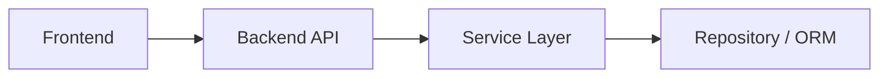

# [Feature 名称] — 技术设计

- **Feature ID**: `FEAT-XXX`
- **Architect**: Architect Agent
- **相关 ADR**: ADR-001, ...

## 架构概览



## API 设计

| Method | Path | 说明 |
|--------|------|------|
| GET | /api/... | |

## 数据模型

```sql
-- 或 Sequelize model 描述
```

## 前端组件

| 组件 | 路径 | 职责 |
|------|------|------|
| | | |

## 安全考虑

- 鉴权: ...
- 输入验证: ...

## 风险与权衡

| 风险 | 缓解 |
|------|------|
